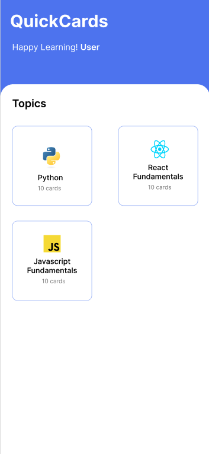
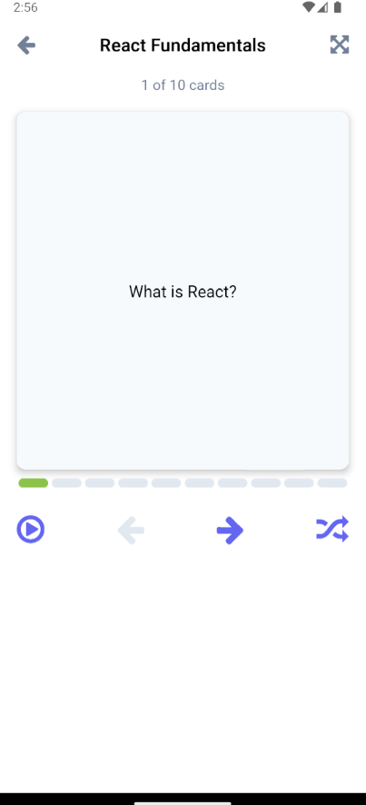
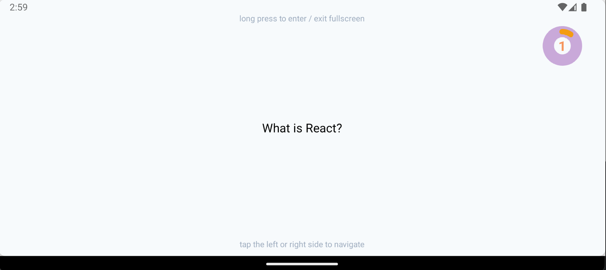

<div align="center"> 
   
  <p><em>Efficient Learning, Anywhere, Anytime</em></p> 
  <a href="https://github.com/your-repo/quickcards"> 
     
  </a> 
  <a href="https://github.com/your-repo/quickcards"> 
     
  </a> 
  <a href="https://github.com/your-repo/quickcards"> 
     
  </a> 
  <a href="https://github.com/your-repo/quickcards/blob/main/LICENSE"> 
     
  </a> 
</div>

<br>

---

This is an [Expo](https://expo.dev) project created with [`create-expo-app`](https://www.npmjs.com/package/create-expo-app).

## DEMO

[App demo and Screenshots](https://drive.google.com/drive/folders/17OIyT40Miq1Q3_RUV1rQUX6RUFrO1kc6?usp=sharing)

<br>

## UI Mockups

<div align="center">
  <table>
    <tr>
      <td align="center">
        <strong>Dashboard</strong><br>
        
      </td>
      <td align="center">
        <strong>Flashcards</strong><br>
        
      </td>
    </tr>
  </table>

  <br>

  <strong>Full Screen Mode</strong><br>
  
</div>

## Get started

1. Install dependencies

   ```bash
   npm install
   ```

2. Start the app

   ```bash
    npx expo start
   ```

In the output, you'll find options to open the app in a

- [development build](https://docs.expo.dev/develop/development-builds/introduction/)
- [Android emulator](https://docs.expo.dev/workflow/android-studio-emulator/)
- [iOS simulator](https://docs.expo.dev/workflow/ios-simulator/)
- [Expo Go](https://expo.dev/go), a limited sandbox for trying out app development with Expo

You can start developing by editing the files inside the **app** directory. This project uses [file-based routing](https://docs.expo.dev/router/introduction).

## Learn more

To learn more about developing your project with Expo, look at the following resources:

- [Expo documentation](https://docs.expo.dev/): Learn fundamentals, or go into advanced topics with our [guides](https://docs.expo.dev/guides).
- [Learn Expo tutorial](https://docs.expo.dev/tutorial/introduction/): Follow a step-by-step tutorial where you'll create a project that runs on Android, iOS, and the web.

## Join the community

Join our community of developers creating universal apps.

- [Expo on GitHub](https://github.com/expo/expo): View our open source platform and contribute.
- [Discord community](https://chat.expo.dev): Chat with Expo users and ask questions.
